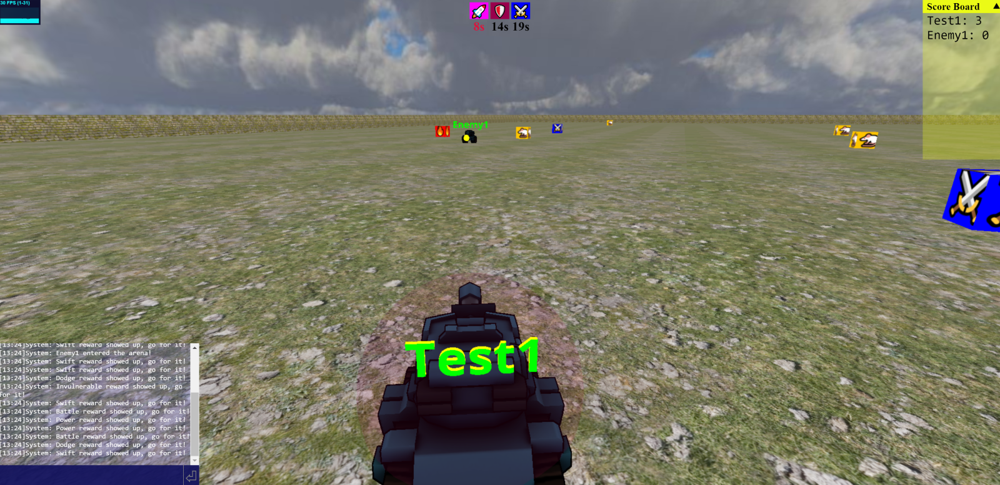

# Tankila
Tankila is a multi player FPS game, implemented by [three.js](https://github.com/mrdoob/three.js), [cannon-es](https://github.com/pmndrs/cannon-es) and WebSockets. Users can move their tanks and shot bullets to gain scores.

# Installation
- minimum node version 16.13.1
- `yarn install`
- create a `.env` config file in the root, the follow configs are required
  - `MONGODB_URI`: mongodb url, game server needs this to connect to mongodb
  - `PORT`: server port, default to 3000 
# Run
## Development
- `yarn client-dev` # build and run client page, a webpack dev server will start
- `yarn server-dev` # start game server
- go to the webpack dev server
## Production
- `yarn client-prod` # build client code in production mode
- `yarn server-prod` # start game server
- go to the game server

# Demo
<a href="https://tankila.utticus.com/" target="_blank">https://tankila.utticus.com</a>
